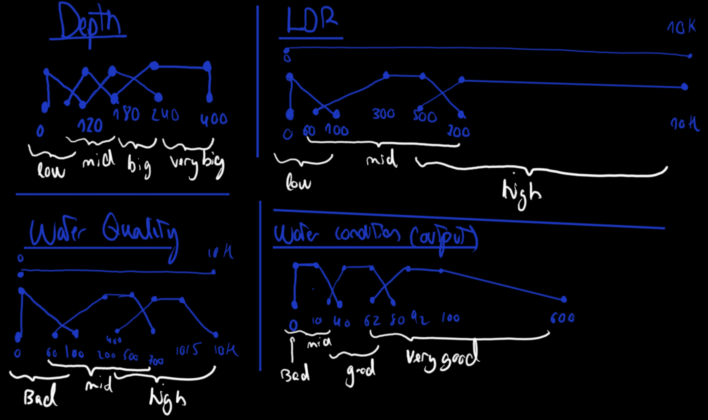
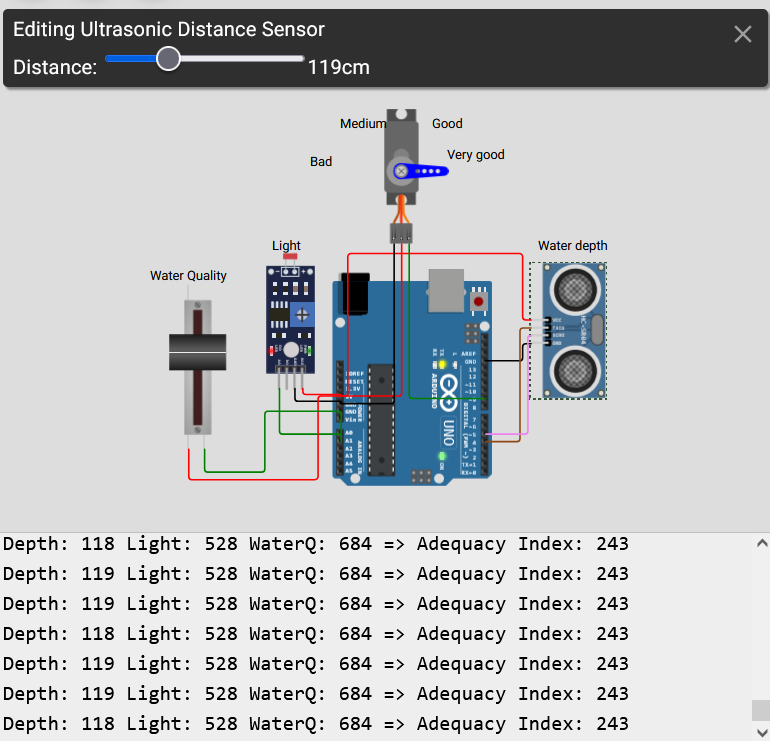

# Actividad 3 (grupal) - Equipos e Intrumentación Electrónica
\
**Miembros del grupo**
- Garzón Fernández, **Carlos Enrique**
- Alonso Cabal, **Patricia**
- Díaz Chamorro, **Ginés**

[Link al proyecto Wokwi](https://wokwi.com/projects/434204445654407169)
---

\
\
Con esta actividad manejaremos diferentes técnicas para perfeccionar un sistema de medición, control, actuación y presentación del clima en una HMI local mediante supervisión inteligente. 

Concretamente nos centraremos en la implementación de **lógica fuzzy**. Por definición, la lógica difusa (también llamada lógica borrosa (en inglés: fuzzy logic) es una lógica paraconsistente multivaluada en la cual los valores de verdad de las variables pueden ser cualquier número real comprendido entre 0 y 1. La lógica difusa (fuzzy logic, en inglés) permite tomar decisiones más o menos intensas en función de grados intermedios de cumplimiento de una premisa; se adapta mejor al mundo real en el que vivimos, e incluso puede comprender y funcionar con nuestras expresiones, del tipo «hace mucho calor», «no es muy alto», «el ritmo del corazón está un poco acelerado», etc.


\


\
En este caso la lógica difusa se aplicará al caso de una boya meteorológica. Tras un poco de *research* por parte del equipo, encontramos [un paper](https://ambiental.cedex.es/docs/ingenieria-civil-138-2005-fuzzy-logic.pdf) interesante que nos ha inspirado a aplicar lógica difusa en nuestra boya meteorológica para el estudio de ecosistemas submarinos. Hasta la fecha, la simulación de los habitata acuáticos se había venido desarrollando por medio de modelos basados en curvas de preferencia de las principales variables hidráulicas relacionadas con la calidad de los hábitats. La lógica difusa ofrece varias ventajas frente a implementaciones clásicas. Con ella, se permite introducir un mayor número de variables. Estas, aumentan de forma significativa las posibilidades de combinación entre ellas, lo que nos lleva a incorporar el conocimiento y valoración de expertos de forma efectiva. 

Tras un debate interno, se llegó a la conclusión de que para el hardware al que estamos destinados, lo mejor sería usar la combinación de los siguientes sensores:

- Sensor de distancia para la profundidad del agua.
- Sensor de luz (sensor de luminosidad).
- Sensor de calidad del agua.


---
\
Para llevar a cabo la implementación, haremos uso de la librería [EFLL](https://github.com/alvesoaj/eFLL) disponible para Wokwi.

Lo primero es definir los rangos para cada uno de los sensores que vamos a usar. Sabiendo los valores de lectura de cada uno de ellos, podemos saber qué regiones vamos a establecer para la función de pertenencia de cada uno de ellos, que tendrá forma trapezoidal.

A continuación puede verse la primera estimación realizada por el equipo para cada sensor, así como sus regiones.



A continuación se muestra el código empleado que, mediante la librería de Fuzzy Logic, nos permite implementar estas regiones.

```C
  // fuzzy sets
  // Water depth (0-400)
  FuzzySet *lowDepth = new FuzzySet(0, 0, 0, 120); 
  FuzzySet *medDepth = new FuzzySet(60, 120, 120, 180);
  FuzzySet *bigDepth = new FuzzySet(120, 180, 180, 240);
  FuzzySet *verybigDepth = new FuzzySet(180, 240, 400, 400);
  
  // ldr (Potentiometer)
  // Illumination ldr (0-100000 lux after conversion)
  FuzzySet *lowldr = new FuzzySet(0, 0, 0, 100);
  FuzzySet *medldr = new FuzzySet(60, 300, 500, 700);
  FuzzySet *highldr = new FuzzySet(500 ,700, 10000, 10000);

  // Water quality
  FuzzySet *badQ = new FuzzySet(0, 0, 0, 100);
  FuzzySet *medQ = new FuzzySet(60, 200, 500, 700);
  FuzzySet *highQ = new FuzzySet(400 ,700, 1015, 10000);

  // Adequacy of water conditions (index)
  FuzzySet *bad = new FuzzySet(0, 0, 0, 0);
  FuzzySet *medium = new FuzzySet(0, 0, 10, 40);
  FuzzySet *good = new FuzzySet(22, 40, 62, 80);
  FuzzySet *verygood = new FuzzySet(62, 92, 100, 600);
```

Por último, tenemos que especificar las reglas que van a dar lugar a nuestras salidas, haciendo uso de la propia lógica Fuzzy. Estas reglas se definen a continuación y vienen inspiradas por el paper anteriormente mencionado.


```C
  // Rule 1
  // IF depth is medium & ldr is high & waterQ is high THEN adequacy is VERY GOOD
  FuzzyRuleAntecedent *ifDepthMedANDLdrHighANDWaterQHigh1 = new FuzzyRuleAntecedent();
  ifDepthMedANDLdrHighANDWaterQHigh1->joinWithAND(medDepth, highldr);
  FuzzyRuleAntecedent *ifDepthMedANDLdrHighANDWaterQHigh2 = new FuzzyRuleAntecedent();
  ifDepthMedANDLdrHighANDWaterQHigh2->joinWithAND(ifDepthMedANDLdrHighANDWaterQHigh1, highQ);
  FuzzyRuleConsequent *thenAdequacyVeryGood = new FuzzyRuleConsequent();
  thenAdequacyVeryGood->addOutput(verygood);
  FuzzyRule *fuzzyRule1 = new FuzzyRule(1, ifDepthMedANDLdrHighANDWaterQHigh2, thenAdequacyVeryGood);
  fuzzy->addFuzzyRule(fuzzyRule1);

  // Rule 2
  // IF depth is medium & ldr is med & waterQ is high THEN adequacy is GOOD
  FuzzyRuleAntecedent *ifDepthMedANDLdrMedANDWaterQHigh1 = new FuzzyRuleAntecedent();
  ifDepthMedANDLdrMedANDWaterQHigh1->joinWithAND(medDepth, medldr);
  FuzzyRuleAntecedent *ifDepthMedANDLdrMedANDWaterQHigh2 = new FuzzyRuleAntecedent();
  ifDepthMedANDLdrMedANDWaterQHigh2->joinWithAND(ifDepthMedANDLdrMedANDWaterQHigh1, highQ);
  FuzzyRuleConsequent *thenAdequacyGood = new FuzzyRuleConsequent();
  thenAdequacyGood->addOutput(good);
  FuzzyRule *fuzzyRule2 = new FuzzyRule(2, ifDepthMedANDLdrMedANDWaterQHigh2, thenAdequacyGood);
  fuzzy->addFuzzyRule(fuzzyRule2);

  // Rule 3
  // IF waterQ is bad THEN adequacy is BAD
  FuzzyRuleAntecedent *ifWaterQBad= new FuzzyRuleAntecedent();
  ifWaterQBad->joinSingle(badQ);
  FuzzyRuleConsequent *thenAdequacyBad = new FuzzyRuleConsequent();
  thenAdequacyBad->addOutput(bad);
  FuzzyRule *fuzzyRule3 = new FuzzyRule(3, ifWaterQBad, thenAdequacyBad);
  fuzzy->addFuzzyRule(fuzzyRule3);

  // Rule 4
  // IF depth is low THEN adequacy is BAD
  FuzzyRuleAntecedent *ifDepthIsLow= new FuzzyRuleAntecedent();
  ifDepthIsLow->joinSingle(lowDepth);
  FuzzyRule *fuzzyRule4 = new FuzzyRule(4, ifDepthIsLow, thenAdequacyBad);
  fuzzy->addFuzzyRule(fuzzyRule4);

  // Rule 5
  // IF depth is big & ldr is high & waterQ is medium THEN adequacy is GOOD
  FuzzyRuleAntecedent *ifDepthBigANDLdrHighANDWaterQMed1 = new FuzzyRuleAntecedent();
  ifDepthBigANDLdrHighANDWaterQMed1->joinWithAND(bigDepth, highldr);
  FuzzyRuleAntecedent *ifDepthBigANDLdrHighANDWaterQMed2 = new FuzzyRuleAntecedent();
  ifDepthBigANDLdrHighANDWaterQMed2->joinWithAND(ifDepthBigANDLdrHighANDWaterQMed1, medQ);
  FuzzyRule *fuzzyRule5 = new FuzzyRule(5, ifDepthMedANDLdrMedANDWaterQHigh2, thenAdequacyGood);
  fuzzy->addFuzzyRule(fuzzyRule5);

```

A continuación, se muestra el ejemplo funcionando mediante lógica Fuzzy al establecer parámetros propicios para ecosistemas marinos.

